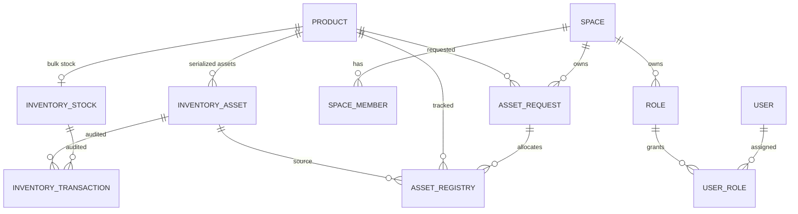

# Backend Split Inventory Refactor

## Architecture Summary

FreechargeIMS now treats products as global catalog records and separates inventory into two tracks:

- Serialized inventory assets continue to use the existing inventory item collection. These records preserve `assetTag`, `serialNumber`, assignment state, lifecycle status, and audit history.
- Bulk inventory uses the new `InventoryStock` collection. It stores aggregate quantities for products whose `Product.trackingType` is `BULK`.

Spaces remain tenant boundaries for requests, memberships, roles, approvals, and asset visibility. Spaces do not own inventory.

## Entity Relationships

## Schema Changes

- `Product.trackingType`: `SERIALIZED` or `BULK`.
- `InventoryStock`: `productId`, `availableQuantity`, `reservedQuantity`, `allocatedQuantity`.
- `InventoryTransaction`: now supports `inventoryStockId`, optional `inventoryItemId`, `quantity`, and `requestId`.
- `AssetRegistry.quantity`: supports bulk allocations while preserving serialized asset links through `sourceInventoryItemId`.
- `AssetRequest.status`: canonical statuses are supported with legacy mappings.

## API Changes

- `GET /api/v1/inventory/assets`
- `GET /api/v1/inventory/assets/:id`
- `GET /api/v1/inventory/stocks`
- `GET /api/v1/inventory/stocks/:productId`
- `GET /api/v1/asset-registry`
- `GET /api/v1/asset-registry/me`
- `GET /api/v1/asset-registry/user/:userId`
- `GET /api/v1/asset-requests/fulfillment-queue`
- `PATCH /api/v1/asset-requests/:id/fulfill`

The legacy `/api/v1/inventory-items` routes remain mounted for backward compatibility.

## Migration Scripts

- `npm run migrate:product-tracking-bulk-stock`
  Adds `trackingType` to products and creates `InventoryStock` records for bulk products without deleting serialized inventory assets.

- `npm run migrate:asset-request-statuses`
  Converts legacy request statuses and workflow step keys to canonical names.

## Warehouse Deprecation

Warehouse routes remain mounted but now emit deprecation headers. Warehouse permissions are mapped to inventory permissions for compatibility. The next cleanup phase should migrate callers away from `/warehouse` and `/storage-locations`, then remove warehouse models, controllers, services, repositories, validators, seed data, and audit entity types.
