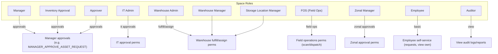

# Space Roles → Permission Areas (Mermaid)

```mermaid
graph TD
  subgraph Space_Roles[Space Roles]
    MANAGER["Manager"]
    INV_APPROVAL["Inventory Approval"]
    IT_ADMIN["IT Admin"]
    WAREHOUSE_ADMIN["Warehouse Admin"]
    WAREHOUSE_MANAGER["Warehouse Manager"]
    STORAGE_MANAGER["Storage Location Manager"]
    FOS["FOS (Field Ops)"]
    ZM["Zonal Manager"]
    EMP["Employee"]
    APPROVER["Approver"]
    AUDITOR["Auditor"]
  end

  MANAGER -->|approvals| APPROVALS["Manager approvals\n(e.g. MANAGER_APPROVE_ASSET_REQUEST)"]
  INV_APPROVAL -->|approvals| APPROVALS
  ZM -->|zonal approvals| ZONAL_APPROVALS["Zonal approval perms"]
  APPROVER -->|approvals| APPROVALS

  WAREHOUSE_ADMIN -->|fulfill/assign| WAREHOUSE_ACTIONS["Warehouse fulfill/assign perms"]
  WAREHOUSE_MANAGER --> WAREHOUSE_ACTIONS
  STORAGE_MANAGER --> WAREHOUSE_ACTIONS

  IT_ADMIN -->|it approvals| IT_ACTIONS["IT approval perms"]
  FOS -->|field ops| FIELD_OPS["Field operations perms (scan/dispatch)"]
  EMP -->|basic| EMP_PERMS["Employee self-service (requests, view own)"]
  AUDITOR -->|view| AUDIT_PERMS["View audit logs/reports"]
```
