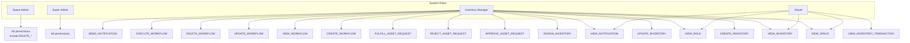

# System Roles → Permissions (Mermaid)

```mermaid
graph TD
  subgraph System_Roles[System Roles]
    SA["Space Admin"]
    SU["Super Admin"]
    IM["Inventory Manager"]
    V["Viewer"]
  end

  SU --> ALL["All permissions"]
  SA --> ALL_EX["All permissions \nexcept DELETE_*"]

  IM --> CREATE_INVENTORY["CREATE_INVENTORY"]
  IM --> UPDATE_INVENTORY["UPDATE_INVENTORY"]
  IM --> VIEW_INVENTORY["VIEW_INVENTORY"]
  IM --> VIEW_SPACE["VIEW_SPACE"]
  IM --> VIEW_ROLE["VIEW_ROLE"]
  IM --> ASSIGN_INVENTORY["ASSIGN_INVENTORY"]
  IM --> APPROVE_ASSET_REQUEST["APPROVE_ASSET_REQUEST"]
  IM --> REJECT_ASSET_REQUEST["REJECT_ASSET_REQUEST"]
  IM --> FULFILL_ASSET_REQUEST["FULFILL_ASSET_REQUEST"]
  IM --> VIEW_NOTIFICATION["VIEW_NOTIFICATION"]
  IM --> CREATE_WORKFLOW["CREATE_WORKFLOW"]
  IM --> VIEW_WORKFLOW["VIEW_WORKFLOW"]
  IM --> UPDATE_WORKFLOW["UPDATE_WORKFLOW"]
  IM --> DELETE_WORKFLOW["DELETE_WORKFLOW"]
  IM --> EXECUTE_WORKFLOW["EXECUTE_WORKFLOW"]
  IM --> SEND_NOTIFICATION["SEND_NOTIFICATION"]

  V --> VIEW_SPACE
  V --> VIEW_ROLE
  V --> VIEW_INVENTORY
  V --> VIEW_INVENTORY_TRANSACTION["VIEW_INVENTORY_TRANSACTION"]
  V --> VIEW_NOTIFICATION
```
